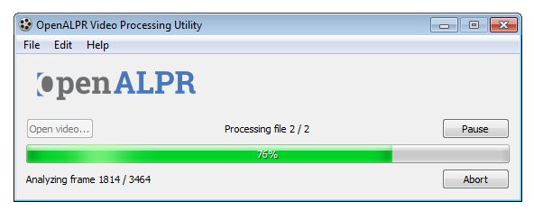

Forensic Plate Finder
=======================

.. _video_processing:

The Forensic Plate Finder processes video or image files (e.g., MPG, AVI, or MP4) to find all of the license plates. The output is a CSV file that lists the license plate information

Installation
--------------

To use this utility, you must have a commercial license key. `Request a free 14-day evaluation key <https://license.openalpr.com/evalrequest/>`_. The license key must be saved in /etc/openalpr/license.conf.

Windows
.........

Download and run the `OpenALPR Forensic Plate Finder Installer <https://deb.openalpr.com/windows-forensic/openalpr-forensic-latest.exe>`_.

After the software is installed, the Forensic Plate Finder will be located in the install directory and as a Windows shortcut on the start menu.

Linux
.........

Install the Watchman Agent following the install procedure in the Watchman Agent section.

Run the following command to install the OpenALPR video utility:

.. code-block:: bash

    curl -L https://deb.openalpr.com/openalpr.gpg.key | sudo apt-key add -
    echo 'deb https://deb.openalpr.com/bionic/ bionic main' | sudo tee /etc/apt/sources.list.d/openalpr.list
    sudo apt update && sudo apt install -y openalpr-video

After the install is complete, you can execute the alprvideogui and alprvideocli utility directly on the command line.

GUI Usage
---------------------

Launch the Forensic Plate Finder by clicking the "OpenALPR Forensic Plate Finder" shortcut created by the installer.

Once launched, choose Edit->Preferences to select the country, number of processing threads, and the output directory.

Click "Open video..." to select files for processing.  The utility can accept:

  - One or more video files
  - One or more JPG image files

Once you've selected one or more files to process, click the "Start" button to begin processing.  Each file will be processed in order.  A spreadsheet for each video file will be placed in the output folder that you specified in the preferences.
  

Command-Line Usage
---------------------

Launch the alprvideocli program with a path to a video file. In addition include an output directory; this is where the CSV and SQLite files are saved. The threads option provides more threads to process the video simmultaneously. This should not exceed the number of CPU cores on the machine.

.. code-block:: bash

    USAGE: 

       ./alprvideocli  --output_dir <output_dir> [-c <country_code>] [--config
                     <config_file>] [-n <topN>] [--threads <num_threads>] [-p
                     <pattern code>] [--save_frames] [--debug] [--motion] [--]
                     [--version] [-h] <video_file_path>

    Where: 

       --output_dir <output_dir>
         (required)  Path to the output directory

       -c <country_code>,  --country <country_code>
         Country code to identify (either us for USA or eu for Europe). 
         Default=us

       --config <config_file>
         Path to the openalpr.conf file

       -n <topN>,  --topn <topN>
         Max number of possible plate numbers to return.  Default=10

       --threads <num_threads>
         Number of simmultaneous processing threads. Default=1

       -p <pattern code>,  --pattern <pattern code>
         Attempt to match the plate number against a plate pattern (e.g., md
         for Maryland, ca for California)

       --save_frames
         Save the image frames for recognized license plates.  Default=off

       --debug
         Print diagnostic information to the console.  Default=off

       --motion
         Use motion detection on video file or stream.  Default=on

       --,  --ignore_rest
         Ignores the rest of the labeled arguments following this flag.

       --version
         Displays version information and exits.

       -h,  --help
         Displays usage information and exits.

       <video_file_path>
         (required)  Video file containing license plates

       OpenAlpr Forensic Plate Finder

Results
---------

The results are made available in CSV files as well as a SQLite database for querying. The image frames in which license plates were found are also optionally saved to a folder on the disk.

The CSV data is exported in two files. One file shows the individual plate reads, while the other shows the plate groups. For example:

Plate Results:

.. csv-table:: Plate Results

    id,group_id,country,plate_number,confidence,frame_num,video_time_s,matches_pattern,tracking_hash,x1,y1,x2,y2,x3,y3,x4,y4,img_name,region,region_confidence
    1,2,gb,CV60UWK,78.4882,70,2.84,1,,36,235,176,280,169,314,29,267,,gb,0
    2,2,gb,CV60UWK,75.4025,73,2.96,1,,134,180,269,220,260,251,127,209,,gb,0
    3,2,gb,CV60UWK,83.4606,74,3,1,,167,159,310,199,300,238,159,196,,gb,0
    4,2,gb,CV60UWK,82.3763,75,3.04,1,,198,141,332,180,322,215,189,177,,gb,0

Plate groups:

.. csv-table:: Plate Groups

    id,country,plate_number,matches_pattern,plate_count,frame_start,frame_end,video_time_start_s,video_time_end_s,best_plate_id,confidence,region,region_confidence
    2,gb,CV60UK,0,6,70,77,2.84,3.12,6,82.6058,gb,0
    1,gb,GP0VZC,0,9,199,211,8,8.48,18,84.4312,gb,0
    4,gb,GR15RYT,1,2,981,994,39.28,39.8,39,82.4912,gb,0

